# Unit 1 Overview of Motor Systems

## Movement Generation and Control

<<<<<<< HEAD
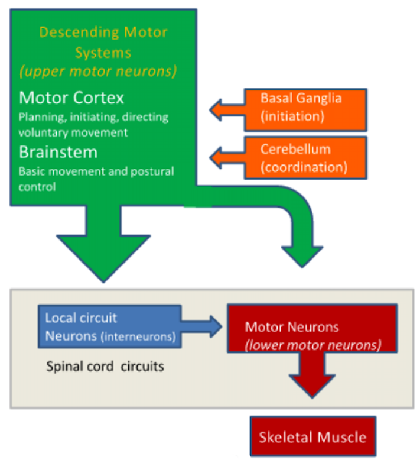
=======

>>>>>>> 5fe3df8df2be6ae9892c61c358e59d71050c568c

The neural circuits controlling movement can be divided into four interactive neural subsystems. The four sub systems showing below are based on the ascending pathway order. 

**1. The gray matter of the spinal cord - lower motor neuron**

The `lower motor neurons` or `alpha motor neurons` are located in **the ventral horn** of **the gray matter** of the cord. The activity of the motor neurons is modulated by local neuron circuits in the cord. The axons of the motor neurons exit the cord through the ventral root and terminate in synapses with striated muscles.

**2. the brainstem and cerebral cortex - upper motor neuron**

The second subsystem consists of neuronal populations located in the brainstem and cerebral cortex. The axons of these `upper motor neurons` travel in descending pathways through the spinal cord to synapse with and control the activities of the **interneurons** and **lower motor neurons**. The descending pathways originating in the cortex are essential for control of **voluntary movements**. Those originating in the brainstem, originate from four distinct nuclei in the brainstem integrate vestibular, somatic and sensory information that helps to organize and coordinate the muscle movements required to successfully navigate through our environment.

> The axons of the upper motor neurons located in the cortex that terminate in the spinal cord and drive activity of the alpha motor neurons that control movements of the limbs and digits comprise the lateral corticospinal tract.

**3. The cerebellum**

The cerebellum make up the third subsystems and play a role in coordinating movements. They exert control of movement by modulating the activities of **the upper motor neurons**. The cerebellum coordinates complex movements by comparing the movement commands issued by the cortex and brainstem with sensory feedback. 

> In the motor pathway, the cerebellum (and the basil ganglia) control movement by altering upper motor neuron.

**4. The basal ganglia**

The cerebellum and basal ganglia make up the fourth subsystems and play a role in initiating movements. The cerebellum and basal ganglia make up the third and fourth subsystems and play a role in coordinating and initiating movements,

## Location of Motor Cortices

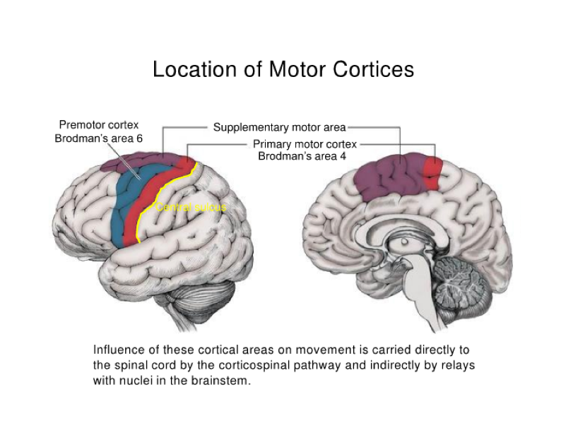

The cortical areas that control movement are located rostral or anterior to the **central sulcus**. Electrical stimulation of neurons in the **primary motor cortex**, which are `topographically` organized, elicits robust movements of specific muscles contralateral to the side of brain stimulation. **Premotor and supplementary motor cortices** are located rostral to the primary motor cortex. Stimulation of neurons in these areas, while able to elicit muscle movements if sufficient current is used, tend to activate bilateral movements involving multiple muscles across joints. We will discuss the brainstem control areas in unit 4.

## Motor Control

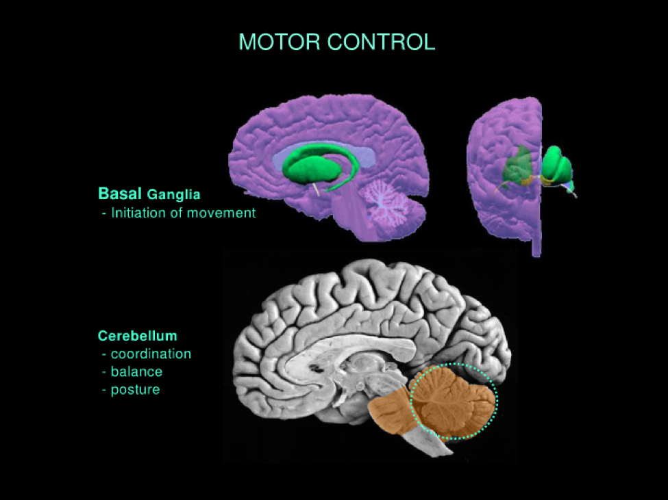

The **basal ganglia** and **cerebellum** play a critical role in modulating motor signaling. The basal ganglia are a group of nuclei that include *the caudate nucleus, the putamen, the globus pallidus, the subthalamic nucleus, and the substantia nigra*. 

The **cerebellar system** includes the *cerebellar cortex, the deep cerebellar nuclei, and the pontine relay nuclei and their tracts, and the cerebellar peduncles*. The purpose of these systems is to assist with the planning, initiation, coordination, and termination of voluntary movements. To do this, each system receives input from the motor cortices that is then processed and sent back to the motor and premotor cortices via the thalamus to modulate their outputs. 

## Initiation and Control of Voluntary Movements

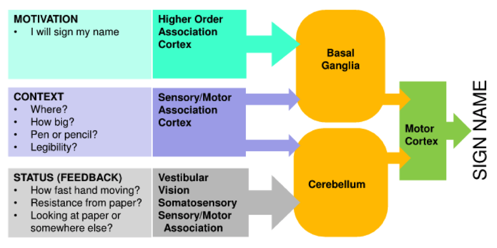

This flow diagram illustrates how the **basal ganglia** and **cerebellum** influence the motor activity required to write our names. When learning to write our names, all of the contextual and feedback information the system provides is essential to reach mastery. As adults, this task takes on reflexive characteristics; however, if the writing surface or pens make the task more challenging it is likely that we will become aware of the feedback information inherent in the system. <u>**The basal ganglia** collect information from sensory, motor and higher order cognitive association cortices to plan and initiate the movement.  **The cerebellum’s** role is to modulate the movement during its execution by collecting and processing sensory feedback information. In the next three units, we will take a closer look at these systems and how they work.</u>

> Alpha motor neurons participate in both voluntary and reflexive control of movement.

# Unit 2 Spinal Cord and Motor Units - Lower Motor Neuron

## Human Spinal Cord

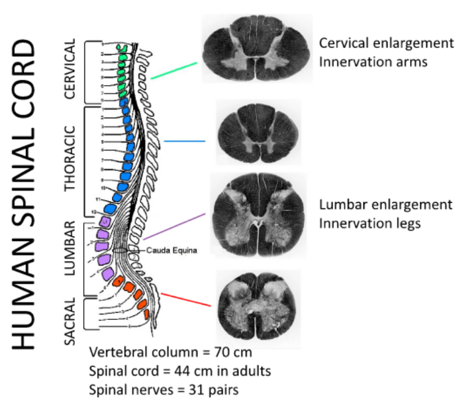

The specific areas we will be interested in in this unit are the ventral horns in the region of the cervical and lumbar enlargements. 
These regions contain the increased numbers of **alpha motor neurons** that are required to control the movements of the striated musculature of the arms and legs, respectively.

## Motor Neuron Pools

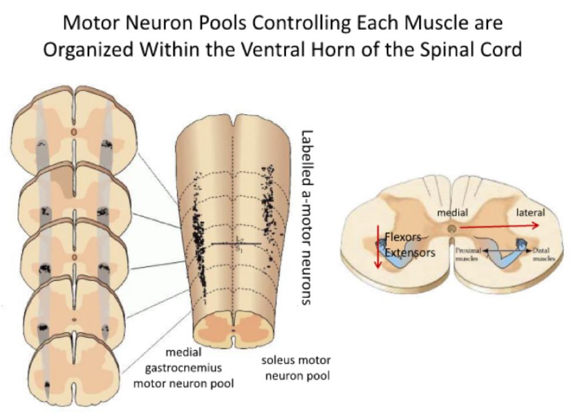

The majority of the neurons that innervate **the skeletal muscles** are located in **the ventral horn**.
<u>Each motor neuron innervates muscle fibers within a single muscle and all of the motor neurons that innervate a single muscle are collectively referred to as a motor neuron pool. </u>

Motor neuron pools are grouped together into rod shaped clusters that run parallel to the long axis of the cord and often cross one or more spinal cord segments.

<u>The motor neuron pools themselves are also organized within the spinal cord. Those innervating muscles in the upper extremity are located in **the cervical enlargement** and those innervating muscles in the lower extremity are located in **the lumbar enlargement**.</u> Within these regions, the motor neuron pools are organized along the mediolateral axis of the cord so that motor neuron pools innervating axial musculature are located near the midline whereas those innervating muscles furthest from the midline are located more laterally. Finally, motor neurons that innervate flexor muscle s are located posteriorly to those that innervate extensor muscles. 

## Motor Neuron to Muscle Fibers

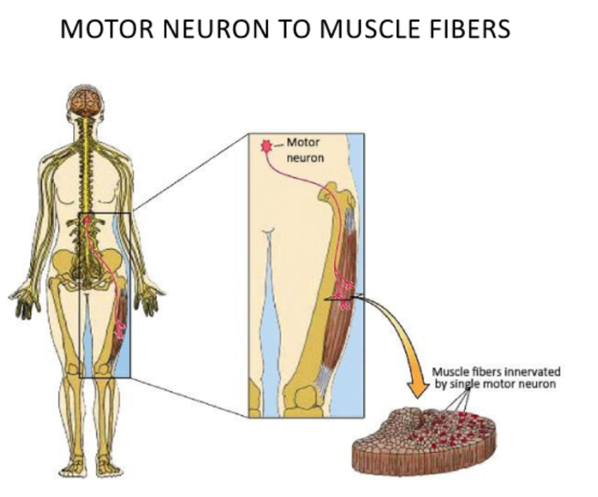

<u>**Most mature skeletal muscle fibers in mammals are innervated by only a single motor neuron; however, each motor neuron synapses with many different fibers in the muscle, all of which are of the same type.**</u>

The action potentials generated by motor neurons normally induce contraction of the fibers they innervate. The muscle fibers and their corresponding motor neurons are referred to as **motor units** and are **_the smallest unit_** that can be activated to produce movement.

There are three types of motor units that are grouped **_according to their strength of contraction and their fatigability_**. 

1.	**Fast, fatigable motor units** generate large contraction forces, contract and relax rapidly, but fatigue after several minutes of stimulation. 
2.	At the other extreme are **the slow motor units** that do not generate much force and contract more slowly, but are highly resistant to fatigue. 
3.	Finally, **the fast, fatigue resistant motor units** generate about twice the force of the slow motor units, are not quite as fast as the fast fatigable units, but are resistant to fatigue. The differences in the functional properties of these motor units stems from the physiology and biochemistry of the various muscle fibers that make up each muscle rather than from the motor neurons that innervate them.

Activation of the three types of motor units is systematic and directly related to the force required to achieve specific movements. **The slow units** are activated or recruited **_first_** for activities such as standing. -> **_The next_** units to be activated are **the fast, fatigue resistant units** that provide additional force for active movement such as walking or running. -> **_Finally_**, **the fast fatigable units** are recruited when maximal force is required for activities such as galloping and jumping. 

## Neuromuscular Junctions

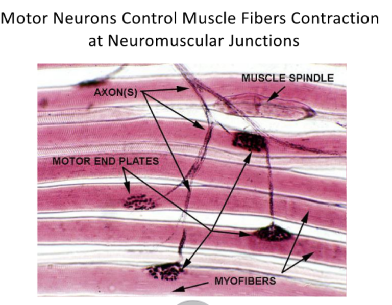

This is a stained tissue section of the **neuromuscular junction**. The branched axon of a single motor neuron is visible in this section and it has formed multiple synaptic connections with the muscle, _one synapse per muscle fiber_. These synapses are referred to as **motor end plates**.

## Diagram of Motor Neuron Contact with Muscle Fiber

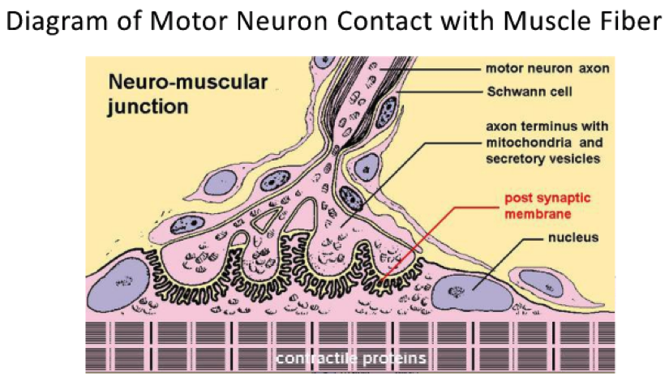

This is a diagram of a neuromuscular junction. The motor neurons innervating the muscle fibers create one synapse per fiber. The groups of fibers innervated by a single motor neuron constitute the motor unit. The axons of the motor neurons are myelinated by **Schwann cells** that **_increase the speed_** with which the action potentials in these axons travel to the muscle fibers. Unlike synapses in the CNS, the synapses between the motor axon terminals and muscle fibers have been _modified_ to help insure that activation of the neuron leads to contraction of the muscle fiber. **One significant modification** is the formation of numerous invaginations in the **post-synaptic surface** that are referred to as **post-junctional folds**. These folds, which form the **motor end-plate**, **_increase the surface area of the muscle fiber membrane exposed to the synaptic cleft_**. The post-junctional folds contain several thousand **acetylcholine receptors** that are able to bind to the acetylcholine transmitter released by the motor neurons.

# Unit 3 Spinal Cord Reflex Circuits

## Stretch Reflex Circuitry

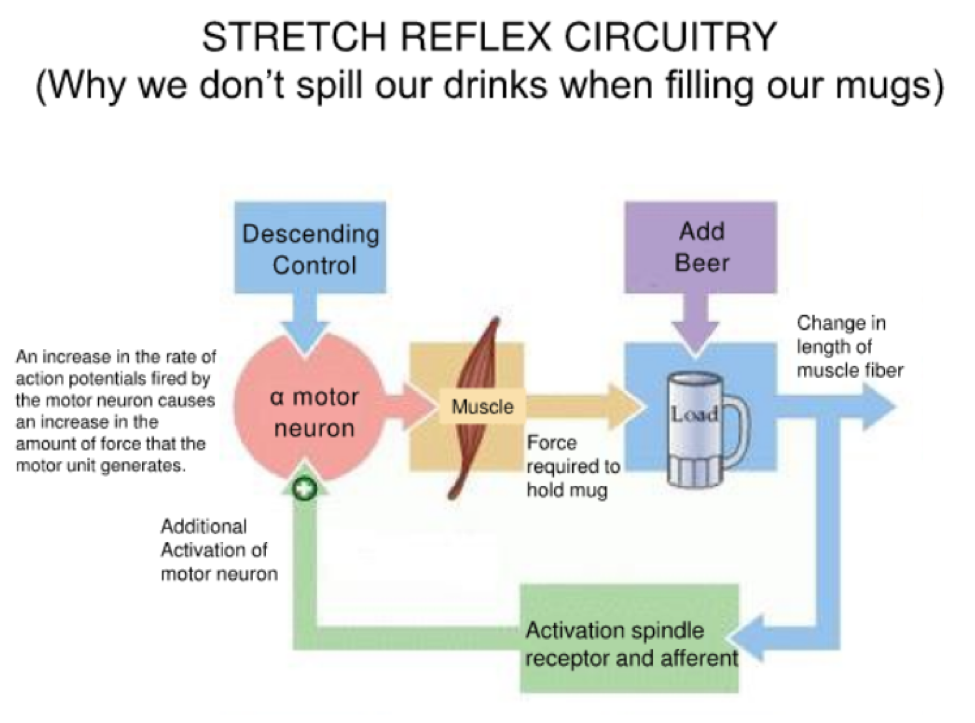

The **stretch reflex** operates as a negative feedback loop to maintain muscle length at the specific value specified by the descending motor pathway to accomplish a specific movement. The movement is initiated by activity in alpha motor neurons that innervate the appropriate fiber groups in the muscle. As conditions change during the action, in this case beer is added to the mug making it heavier, sensory afferents detect the unexpected stretching of the muscle fibers. Signals from these afferents are sent to the cord where they modify the activities of the motor neuron pool to adjust the muscle force required to successfully carry out the movement.

## Muscle Splindle

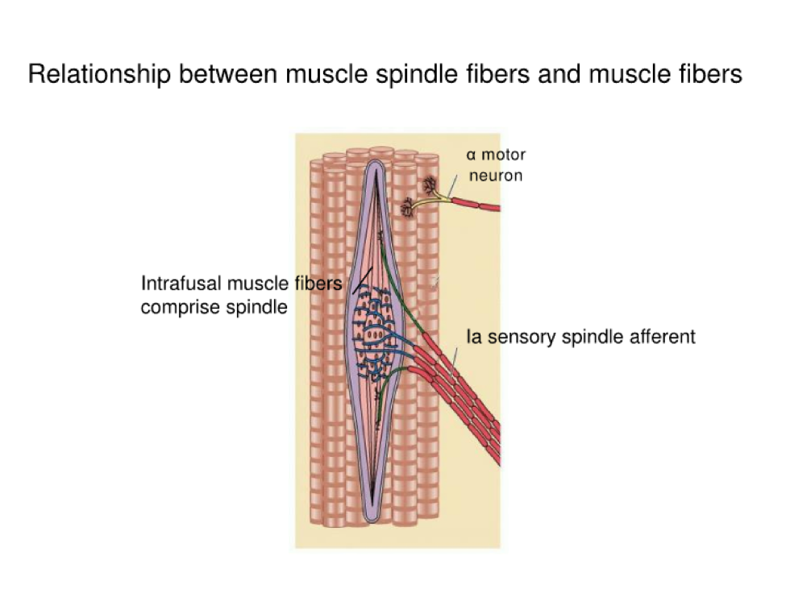

The sensory signal for **the stretch reflex** originates in specialized structures called **muscle spindles**. Each muscle spindle is composed of 8 to 10 modified muscle fibers called **intrafusal fibers**. The muscle spindles are embedded within the muscle and are aligned parallel to the muscle fibers. **The afferent sensory fibers** are coiled around the central part of the spindle and are activated via **stretch-sensitive ion channels** when the muscle fibers stretch. The sensory fibers encode changes in muscle length and velocity by changing their action potential firing rates. 

## Stretch Reflex in Action

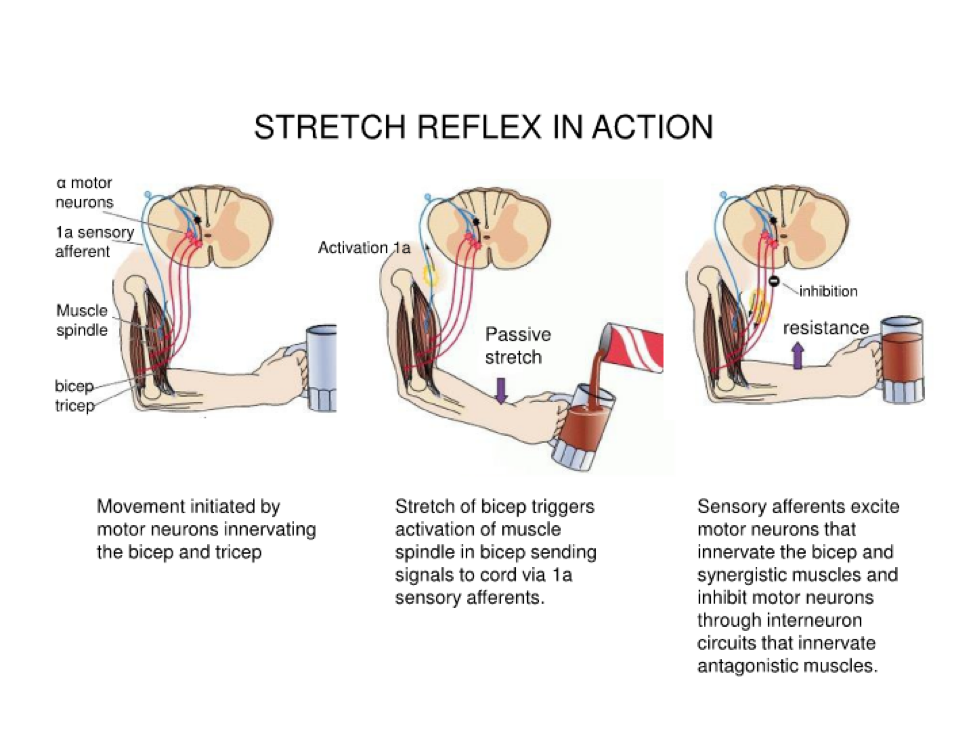

This cartoon depicts the sequential events that occur when the stretch reflex is activated. This reflex induces rapid changes in muscle tension that are required to execute smooth movements. Interestingly, because the muscle spindles are **_modified muscle fibers_**, they are able to adjust the sensitivity of the reflex to match the muscle adjustments required in different situations. For example, the gain of this reflex would be increased when standing on a moving bus to compensate for starts and stops of the bus to prevent falling over, and would be lowered when standing on an elevator.

## Flexion Crossed-Extension Reflex

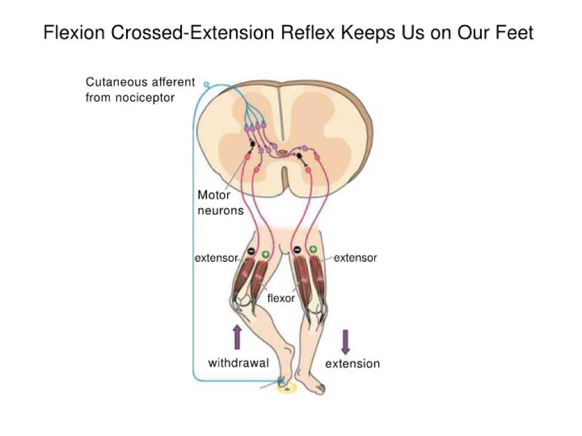

A slightly more complicated reflex circuit is depicted here. **The flexion crossed-extension reflex** involves coordinated **bilateral activation** of opposing muscle groups. This reflex circuit is triggered by activation of sensory receptors that are not located within the muscles themselves. The flexion reflex is a multi-synaptic circuit that permits rapid withdrawal of limbs from sudden painful stimuli. In this example, <u>stimulation of nociceptive sensory fibers in the right foot leads to contraction of right **flexor** muscles and inhibition of the right **extensor** muscles. This **flexion** response is accompanied by the crossed-extension **reflex** in the left leg.</u> Activation of the extensor muscle in the left leg allows us to maintain balance during withdrawal of the right leg from the painful stimulus. 

Our movements are not just a compilation of reflexes. For example, if we accidently touch a hot surface with our hand we quickly withdraw our hand from the surface. However, if heat starts to come through oven mitts when we remove hot dishes from the oven, we try not to reflexively drop the dish; instead, we run to the counter to put the dish down.

## Central Pattern Generators

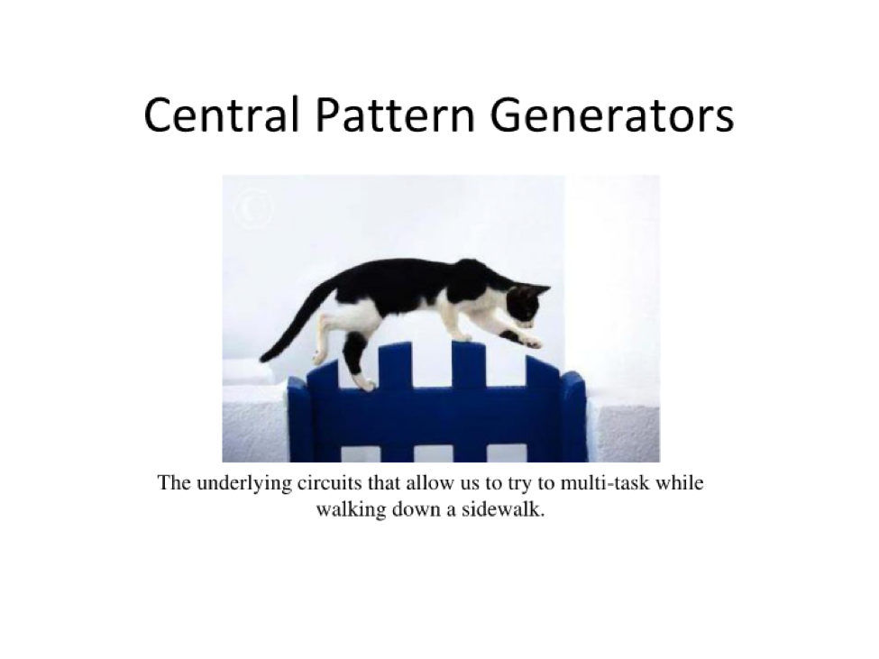

**Central pattern generators** can be defined as **_intrinsic spinal processors_** that correct imperfect sensory feedback and adapt input from higher cortical areas to optimize movement. Humans possess a central pattern generator for **locomotion** that is capable not only of _rhythmic pattern generation_ but is also remarkably _adaptable_. These neural networks are distributed throughout the lower thoracic and lumbar regions of the spinal cord and continue to drive motor movements even in the absence of cortical input. There are also central pattern generators that help to control rhythmic movements of the tongue, swallowing, chewing, and respiration.

Although the theory of central pattern generation calls for basic rhythmicity and patterning to be centrally generated, CPGs can respond to sensory feedback to alter the patterning in behaviorally appropriate ways. Alteration of the intrinsic motor pattern is difficult because feedback received during only one phase of the movement may require changes in movements in the other parts of the patterned cycle to preserve coordination of the movement. For example, walking with a pebble in the right shoe alters the entire gait, even though the stimulus is only present while standing on the right foot. Even during the time when the left foot is down and the sensory feedback is inactive, action is taken to prolong the right leg swing and extend the time on the left foot, leading to limping.

# Unit 4 Descending Control of Spinal Cord Circuits

## Location of Motor Cortices

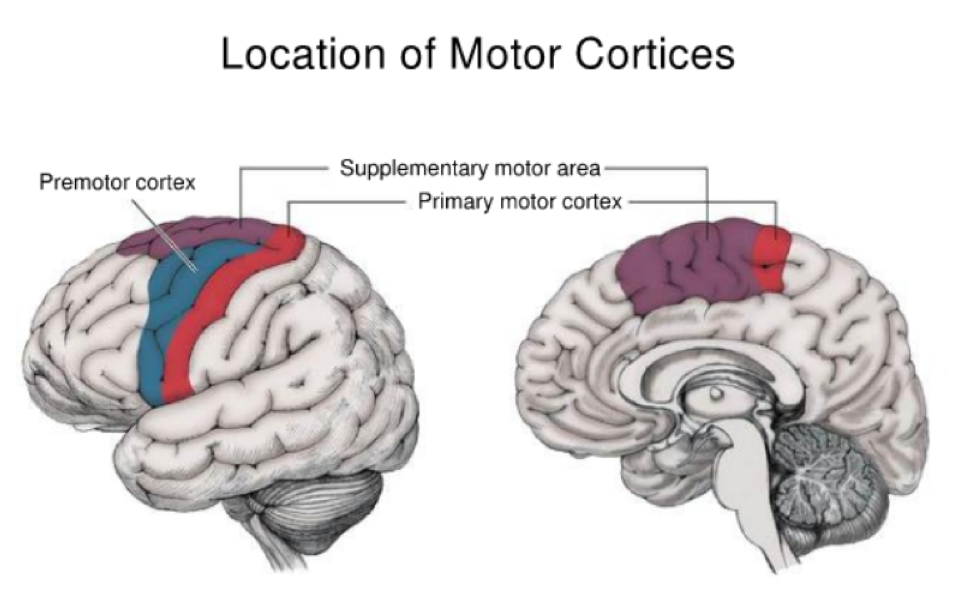

The locations of the motor cortices are shown here. The primary motor cortex is located on the gyrus just anterior to the central sulcus and the premotor and supplementary motor cortices are located anterior to the primary motor cortex.

## Motor Homunculus

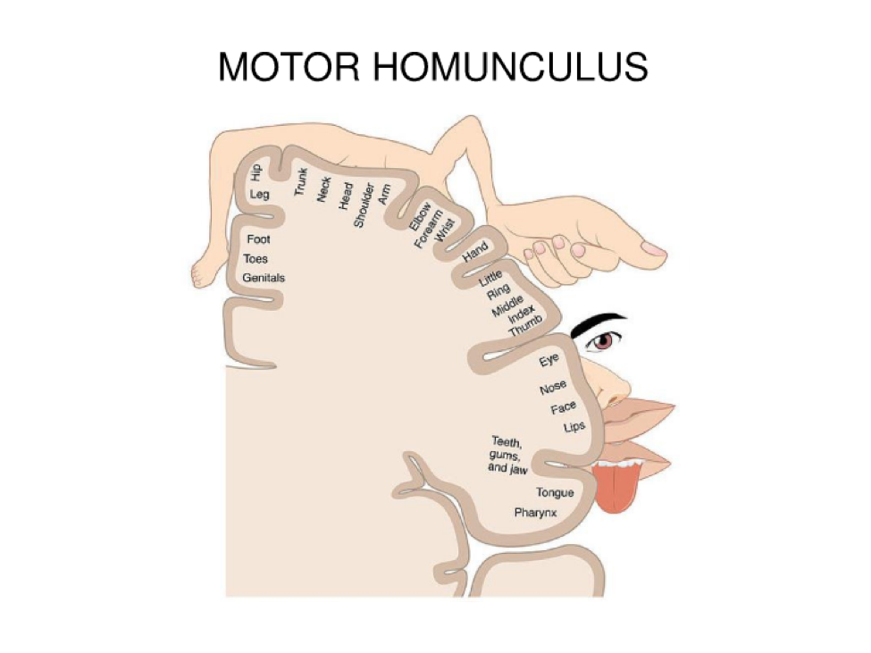

The primary motor cortex is organized **_somatotopically_** in terms of the body’s musculature. Neurons controlling facial musculature are located on the lateral surface of the precentral gyrus above the Sylvian fissure and those controlling the leg musculature are located on the medial surface of the precentral gyrus. The neurons controlling the trunk, neck, head, shoulder, arm, and hand are located between these two regions along the surface of the precentral gyrus. **This organizational scheme is often referred to as the motor homunculus**. <u>It is important to note that the cortical area devoted to controlling muscle groups involved in fine motor movements are much larger than those controlling the axial musculature. This differential assignment of cortical real estate is similar to that found in primary visual cortex.</u>

The planning and execution of movements is controlled by the motor and premotor cortices. Interestingly, the exact nature of the relationship between the motor map and motor control is still debated. Micro-circuit stimulation suggests that individual cell columns in the motor cortex activate single muscles; much like a key on a piano activates vibration of a specific string. The results of more recent studies, together with data from additional micro-stimulation experiments, suggest that individual motor neurons in primary cortex terminate on groups of spinal motor neurons that innervate different muscles. Overall, the topographical map of the cortex is correct – the underlying fine circuitry still remains somewhat mysterious.

## The Corticospinal Tract

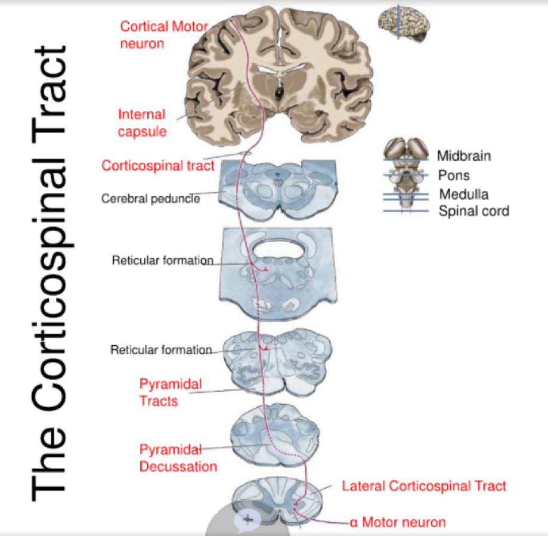

The major descending motor pathway originates in the primary motor cortex. The axons of **pyramidal neurons** located in layer V of the primary motor cortex are some of the longest in the nervous system, many of which synapse directly on the alpha motor neurons in the ventral horn of the spinal cord. The axons of these motor neurons travel in the **internal capsule** of the **forebrain** and then in the **cerebral peduncle**. At the base of the **midbrain**, they pass through the base of the **pons** and **coalesce** on the **ventral surface of the medulla** forming the right and left **pyramidal tracts**. Most of these fibers cross in the **pyramidal decussation** forming the **lateral corticospinal tracts** that travels in the spinal cord. The axons that do not cross form the **ventral or anterior corticospinal tracts**. As a result of this crossing, the right motor cortex controls the musculature on the left side of the body and vice versa. The descending motor axons from the primary motor cortex are arranged **_somatotopically_** in the **internal capsule, the cerebral peduncle, and in the pyramidal tracts**.

## The Corticospinal Tract (Cont.)

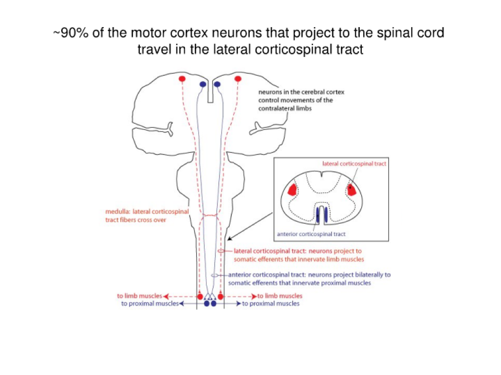

This summary diagram highlights the fact that the axons of the motor neurons in the **primary motor cortex that innervate the proximal (trunk) muscles do not cross at the medulla and travel in the ventral or anterior corticospinal tracts that run adjacent to the midline in the white matter of the ventral cord**. When these axons reach the motor neurons at the level of the spinal cord that they innervate, they often branch and innervate neurons on both sides of the cord. The lateral corticospinal tracts do not share this bilateral innervation pattern.

* **Lateral corticospinal tracts**: limb muscle\ cross at the medulla \no bilateral innervation pattern
* **Ventral or anterior corticospinal tracts**: proximal muscle\do not cross at the medulla\ bilateral innervation pattern\ in the white matter of the ventral cord.

## The Corticospinal Tract (Cont.)

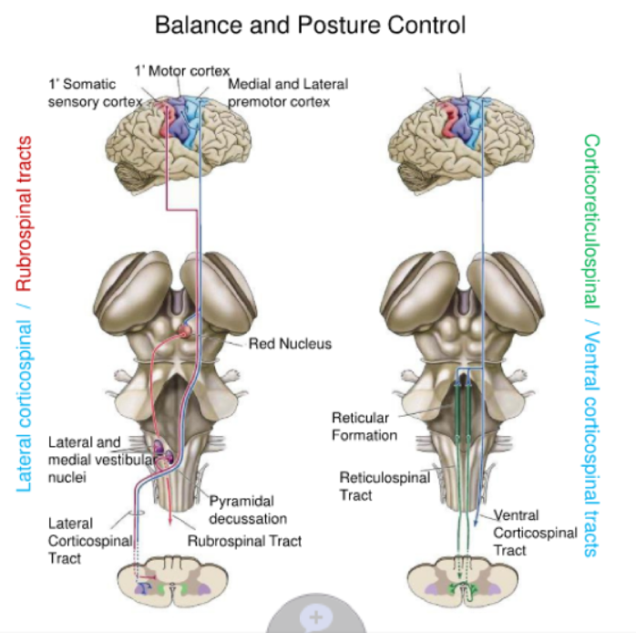

Neurons in the motor cortex that control muscle groups in the extremities can affect the activities of the alpha motor neurons located in the lateral aspects of the ventral horn of the spinal cord through **_direct_** synaptic connections with these cells. This direct pathway is the **lateral corticospinal tract**. A second **_indirect_** pathway originating from these motor cortex neurons is the **rubrospinal tract**. It controls **_voluntary_** movements of **_large muscle groups_** as well as fine motor control and terminates primarily in the cervical spinal cord. In studies of monkeys in which the lateral corticospinal tract was interrupted, the rubrospinal tract was able to support motor movements but they lacked the speed, agility and precision of normal movements.

The **ventral corticospinal tract** provides a **_direct_** connection between the motor cortex and the motor neurons located in the medial region of the ventral horn that control **_axial musculature_**. This pathway is also paired with a second **_indirect_** pathway that is routed through the reticular formation. The **reticulospinal tract** plays an important role in postural regulation and in particular in triggering movements that anticipate changes in body stability.

* **lateral corticospinal tract**: direct (motor cortex - motor neurons)\ lateral aspects of the ventral horn\ control muscle groups in the extremities - limbs
	* **rubrospinal tract**: indirect\ voluntary movements, fine motor\ lacked the speed, agility and precision of normal movements.

* **ventral corticospinal tract**:  direct (motor cortex - motor neurons)\ medial region of the ventral horn\ axial musculature
	* **reticulospinal tract**: indirect\ postural regulation and body stability.

## Location of Descending Motor and Ascending Sensory Pathways

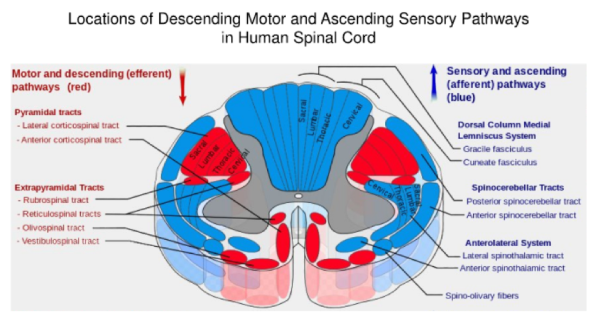

The locations of the descending motor tracts that we have discussed are summarized on this schematic cross-section of the spinal cord. Note that the lateral corticospinal tract fibers remain somatotopically organized as they travel down the cord to innervate their target motor neuron pools. We will not be discussing the ascending sensory pathways in this course. These pathways carry pain, touch, and temperature sensory information from the periphery to the thalamus where they are then routed to the appropriate cortical areas. The primary somatosensory cortex, which is located adjacent to the primary motor cortex just posterior to the central sulcus is organized in a somatotopic manner like the motor cortex.

