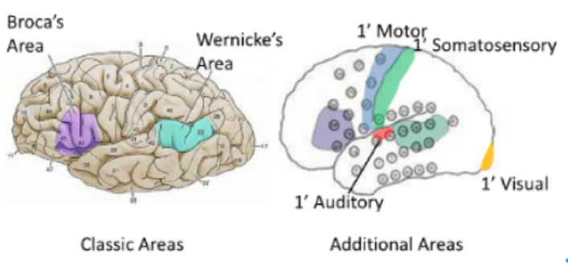
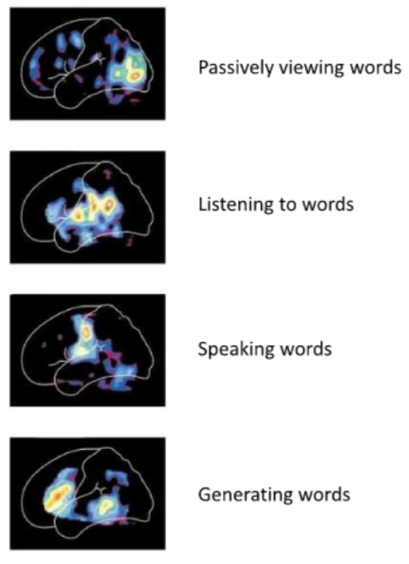
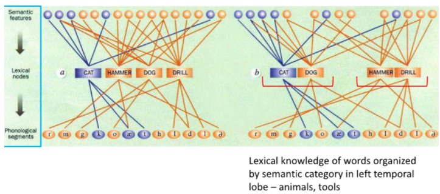
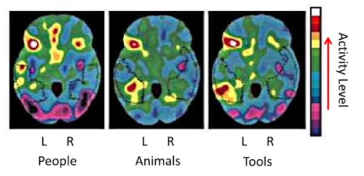
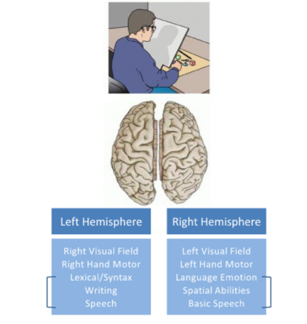
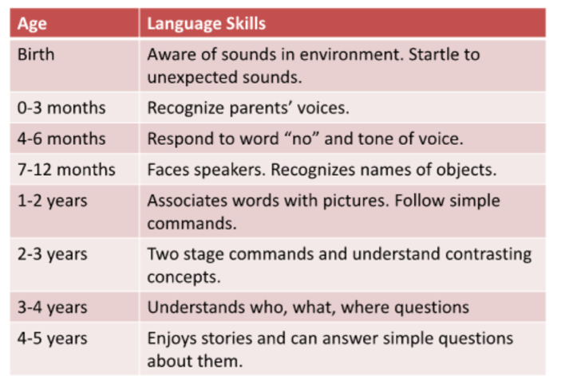
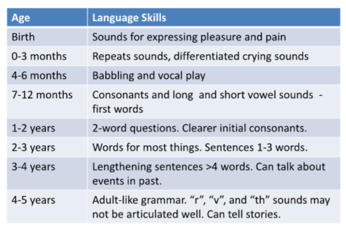
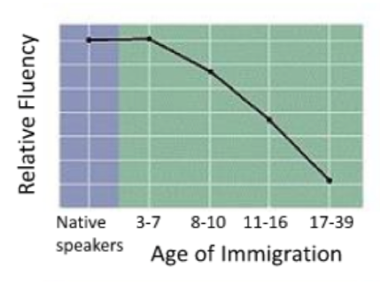

## Cortical Mapping of Language Processing 

The two classic areas involved in processing language are located in most individuals in the **left hemisphere**. They are **Broca’s area and Wernicke’s area**. The representation of language in the brain is distinct from the circuitry involved in _**motor control** of the structures required to produce speech_, as well as from circuits involved in _**auditory perception**_. 

<u>It is noteworthy that motor control and auditory areas are adjacent to Wernicke’s and Broca’s areas since the later are involved in the comprehension of written and spoken language, and in the production of speech, respectively.</u>

## Positron Emission Tomography (PET) of Normal Human Left Hemisphere

This series of **PET scans** show how brain regions involved in language processing are activated in an individual who is actively carrying out tasks related to generating speech and language comprehension.
 
PET is a nuclear medicine functional imaging technique in which <u>a biologically active molecule, like an analogue of glucose, is radiolabelled and then its concentration levels in the brain monitored.</u> Highest levels will be localized to areas of the brain that are most metabolically active. 

1. In the top panel, the cortical area activated most when viewing words is the primary visual cortex. 
2.	When listening to words, the primary auditory cortex is highly active as is Wernicke’s area. 
3.	When speaking words, there is activation of both the primary motor and somatosensory cortices. 
4.	Finally, when generating words we see activation of both Broca’s and Wernicke’s areas.

## Two Models of the Organization of Word Knowledge
### Difference is in how lexical information stored in temporal lobe

How are words **stored and accessed** in the brain? A long-standing view held by cognitive neuroscientists is that during speech production, word retrieval occurs in _**two stages**_. <u>1) Representations at the conceptual level are used to select categorical or lexical representations and then 2) these representations are used to access specific phonemes.</u> Until recently, evidence for the presence of organization of word categories has come from patients with brain damage. These studies showed that strokes and selective brain damage can result in highly selective deficits in accessing semantic word categories such as animals, tools, proper names, and fruits and vegetables. 

The paper you read describes a recent study in which **Damasio** used both **anatomical correlation data and functional brain imaging** using positron emission tomography (PET) <u>to determine if there is evidence that word categories are organized in group in the brain and more specifically in the left temporal lobe.</u>

Two of the models for the organization of words or lexical information in the temporal lobe are shown here. In both models the sematic features of word production, such as carnivorous, furry, or domesticated, activate specific lexical nodes that then activate phonological information.  <u>The unknown was how to explain patients that exhibited an inability to access specific semantic groups.</u> This problem could reflect either damage to the areas that process semantic information or the connections between semantic information and the lexical nodes. Damasio’s data suggest (right) that the lexical information is grouped by categories and that deficits in these groupings could explain the observations in patients. They found evidence that <u>an inability to name words in specific categories could be attributed to a deficit in lexical retrieval (bottom part) rather than in semantic processing (top part).</u>

## Temporal Lobe Activation to Different Word Categories

 
This slide sums up Domasio’s PET scan data that provide evidence that **word category groups can be identified in the temporal lobe in Wernicke’s area :** 

1. recalling people’s names activated the left temporal pole; 
2. recalling animal words activated the left inferior temporal lobe;  
3. recalling names of tools activated the posterior inferior temporal lobe and the temporo-occipito-parietal junction.

The idea is <u>that these specific brain areas in the temporal lobe serve as “glue” between the conceptual information that is distributed within the right and left cortices to the phonological information.</u> These data are not without critics since other studies of word category locations in brain suggest that :

1. Areas outside Wernicke’s area may house these neurons. 
2. Other interesting questions include whether word categories that are more abstract like society and justice are also encoded in groups in the temporal lobe. 
3. Where grammar and syntax are encoded are of great interest?

## Linguistic Specialization Most Prevalent in Left Hemisphere

**Language processing in the brain is not equally distributed between the two hemispheres, but is instead lateralized so that in most individuals** : 

1. the left hemisphere is specialized for processing verbal and symbolic material 
2. the right hemisphere processes the visuospatial and emotional aspects of language. 

The most compelling data for hemispheric lateralization of language functions was obtained from patients whose **corpus callosum** and **anterior commissure** were severed to treat severe epilepsy. Recall that <u>the corpus callosum and anterior commissure are fiber tracts that serve to connect the two hemispheres of the brain.</u> Severing them essentially creates a brain with two halves that cannot talk to each other, a condition called _**“split brain”**_. By studying the language capabilities of these persons, it was possible to assign specific language functions to the two hemispheres, functions that are summarized here.

You should be able to understand them based on your working knowledge of the visual and motor pathways and their lateralization. One example is that split-brain <u>patients whose primary language centers are in the left hemisphere can name objects held in the right hand without difficulty but cannot name an object held in the left hand. This result can be explained by the fact that the right half of the body is controlled by the left motor and somatosensory cortices.</u> The video of the split brain patient is quite enlightening. Many aspects of their life are perceived by them as normal, a testament to human adaptability. It is also very interesting that congenitally deaf individuals who learned sign language as infants also show similar deficits in their abilities to generate and interpret sign language when surgically treated for epilepsy. <u>This observation indicates that processing of language by the brain, whether spoken or signed, is encoded in similar brain regions.</u>

## Timeline of Receptive Language Development

In the final part of this unit I will cover a bit about language development in children. When talking about language acquisition in children we refer to both **receptive and expressive language development**. One of the primary tools to measure language acquisition in young infants is <u>to monitor changes in sucking rate when exposed to various aspects of language</u>. In general, infants increase their sucking rate when novel objects and sounds are presented to them. The time lines for acquisition of both receptive and expressive language skills are very similar. On this slide we see the timeline for receptive language development. If you have had the opportunity to be around infants and young children, you will realize that this timeline describes this process fairly accurately for most children.  Deviations in this timeline can indicate underlying neurological problems.

## Timeline of Expressive Language Development

This is the timeline for a child to acquire the ability to use language to communicate with others. Studies of the ability of children to acquire a second language suggest that there is a “critical period” during which time learning language is easiest. <u>The age between birth and about 7 years of age seems to represent the “critical period” for language acquisition in humans.</u> Perhaps most intriguing are the observations that congenitally deaf children acquire sign language skills along this same timeline. It is possible to learn new languages after this time, but it becomes more difficult since the acquisition of language at these later times moves from a subconscious process of acquisition to a conscious learning process. The article on language development in bilingual children provides some interesting insights into how language learning occurs. Clearly there can be a bit of individual variation in how the acquisition of multiple languages occurs, whether simultaneously or sequentially.

## Optimal Period for Learning Language

This graph shows the dramatic fall off in the fluency of acquired second languages. By college age and beyond, language acquisition can be a tough row to hoe. There are exceptions to these generalized data. It appears that individuals who have mastered more than one language at an early age are better able to acquire new languages. <u>This observation might suggest that the information supporting each language is stored in parallel in the brain. Perhaps once the language brain network is in place, language acquisition takes on plug-and-play characteristics.</u>

